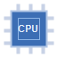

# CPU Core Scheduling Visualizer

An interactive 2D visualization of how an operating-system scheduler
might assign processes across four CPU cores over time. Built with C++
and SDL2 for an Operating Systems class final project.

The simulation is purely illustrative — it does **not** drive the real
OS scheduler — but the layout, color coding, and update cadence mimic
what an actual scheduling monitor would look like.



---

## Features

- Dashboard-style window (1024×720) rendered with SDL2
- Four core rows, each animated as colored timeline blocks
- Live stats: CPU utilization %, active process count, current algorithm
- Legend strip identifying every process color
- Two switchable scheduling policies: Round Robin and Priority
- Pause / resume, reset, and a scrollable event log
- CPU icon loaded with SDL_image; graceful fallback if the file is missing
- Tick rate of 500 ms (configurable in `App.h`)

## Project layout

```
os-final-gui/
├── Makefile
├── README.md
├── prompt.md
├── src/
│   ├── main.cpp        # entry point
│   ├── App.h / App.cpp # window, event loop, panel layout
│   ├── Scheduler.h /.cpp # simulated round-robin / priority scheduler
│   ├── Renderer.h /.cpp  # SDL drawing + font + texture helpers
│   └── Types.h         # shared structs and enums
└── assets/
    ├── fonts/          # drop a font.ttf here (auto-falls-back otherwise)
    └── images/
        └── cpu.png     # CPU icon loaded via SDL_image
```

## Build (Linux)

Install the SDL2 development packages and a fallback font:

```bash
sudo apt install build-essential libsdl2-dev libsdl2-image-dev libsdl2-ttf-dev fonts-dejavu-core
```

Then build and run from the project root:

```bash
make
./scheduler_viz
# or
make run
```

Clean build artifacts with `make clean`.

> **Note on fonts.** The renderer searches `assets/fonts/font.ttf` first
> and falls back to common system font paths. If you see
> `Renderer: failed to load any TTF font.`, copy any `.ttf` into
> `assets/fonts/font.ttf` (DejaVuSans works well).

## Controls

| Key | Action |
|-----|--------|
| `1` | Switch to Round Robin scheduling |
| `2` | Switch to Priority scheduling |
| `Space` | Pause / resume the simulation |
| `R` | Reset all timelines and the event log |
| `Up` / `Down` | Scroll the event log one line |
| `PageUp` / `PageDown` | Scroll the event log five lines |
| `Esc` or `Q` | Quit |

## Implementation notes

- **Tick loop.** `App::update` advances the scheduler every 500 ms. While
  paused we re-anchor the timer instead of catching up, so resuming does
  not produce a burst of ticks.
- **Round Robin.** Cores are filled from a fixed `{A, B, C, IDLE}` order
  with the starting offset rotated each tick, producing the expected
  diagonal "barber pole" pattern.
- **Priority Scheduling.** Each core independently samples a process with
  weights derived from per-process priorities, so higher-priority work
  occupies more of the timeline while idle gaps still appear.
- **Event log.** `Scheduler::recordAssignment` only logs *transitions* on
  a core (e.g. `Process A assigned to Core 2`, `Core 1 idle`) so the log
  stays readable even at one tick per half-second.
- **Fallback rendering.** If `assets/images/cpu.png` is missing the
  renderer draws a procedural chip icon, and if no TTF can be found the
  program exits with a clear error before opening the window.
